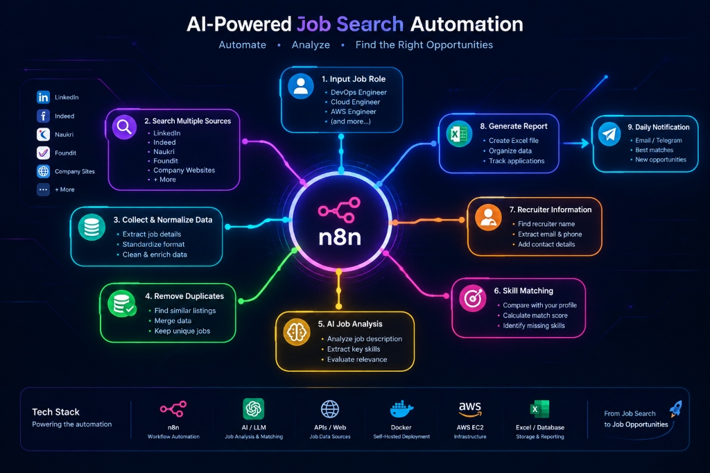

# 🚀 DevOpsPulse: Automated Multi-Portal Job Search & AI Application Dispatcher

> **An enterprise-grade, end-to-end automation platform that aggregates vacancies across 13 job portals, scores candidate fit via AI, tracks applications with real-time status ribbons, and dispatches personalized cold emails with attached resumes.**

---

## 📌 1. Executive Summary & Problem Statement

### The Problem
The contemporary tech job search (especially for DevOps, Cloud, and SRE roles) is deeply fragmented and labor-intensive:
- Job postings are scattered across dozens of platforms (**LinkedIn, Indeed, Naukri, Glassdoor, ZipRecruiter, Google Jobs, local IT park directories like Infopark and Technopark, and remote boards like RemoteOK, WeWorkRemotely, and Jobicy**).
- Many candidates suffer from application fatigue: manually scouring portals, tailoring resumes, writing repetitive cold emails to recruiters, and losing track of what has already been applied to.
- Cloud datacenter IPs (like AWS EC2) encounter aggressive bot protection (Akamai, Cloudflare, PerimeterX), causing standard web scrapers to fail or return 0 listings.
- Generic scrapers lack domain intelligence, pulling irrelevant jobs (QA Manual, Digital Marketing, Visual Builders) under generic keywords like `"engineer"`.

### The Solution: DevOpsPulse
**DevOpsPulse** is a fully automated, microservices-based job search engine and application management platform:
1. **Unified Multi-Source Scraping**: Simultaneously searches **13 job platforms** with dual-layer anti-bot fallback (JobSpy + live search dorks).
2. **AI-Powered Fit Scoring**: Compares candidate skills, target titles, and years of experience against job specifications (0–100% match score).
3. **Domain-Specific DevOps Filtering**: Strict keyword exclusion and inclusion heuristics to eliminate non-engineering vacancies.
4. **Interactive Application Tracker (ATS)**: Automatically marks jobs as *"Already Applied"* on portal click or cold email dispatch, complete with status ribbons, dates, channels, and 1-click manual toggles.
5. **Direct Recruiter Outreach Engine**: Built-in cold email composer integrated with Gmail API and n8n webhooks, generating personalized pitches and automatically attaching the candidate's PDF resume.
6. **Containerized Cloud Architecture**: Deployed via Docker Compose on AWS EC2 with Caddy auto-renewing SSL certificates.

---

## 🏗️ 2. System Architecture & High-Level Design

```
                                  ┌─────────────────────────────────────────┐
                                  │             USER BROWSER                │
                                  │     Next.js 16 Web Dashboard UI         │
                                  └────────────────────┬────────────────────┘
                                                       │
                                          HTTPS (Port 443) via Caddy
                                                       │
                                                       ▼
┌──────────────────────────────────────────────────────────────────────────────────────────────────┐
│                                         AWS EC2 HOST                                             │
│                                                                                                  │
│  ┌─────────────────────────┐         ┌────────────────────────────────────────────────────────┐  │
│  │    Caddy Reverse Proxy  │────────▶│            Web Application (Next.js 16)                │  │
│  │   (Automated SSL/TLS)   │         │  - JobExplorer: 13-portal selector, Indian IT cities   │  │
│  └─────────────────────────┘         │  - JobCard: Radial score, "Already Applied" ribbon     │  │
│                                      │  - Application Tracker: LocalStorage + Server sync     │  │
│                                      │  - Mailing Studio: Gmail Dispatcher + PDF Resume       │  │
│                                      └───────────────────────────┬────────────────────────────┘  │
│                                                                  │                               │
│                                                      REST APIs & Webhooks                        │
│                                                                  │                               │
│                                      ┌───────────────────────────┴────────────────────────────┐  │
│                                      ▼                                                        │  │
│                      ┌───────────────────────────────┐                                        │  │
│                      │      n8n Automation Engine    │                                        │  │
│                      │  - Cron & On-Demand Triggers  │                                        │  │
│                      │  - Master Workflow Execution  │                                        │  │
│                      │  - Deduplication Hash Engine  │                                        │  │
│                      │  - Gmail Outreach Dispatcher  │                                        │  │
│                      └───────────────┬───────────────┘                                        │  │
│                                      │                                                        │  │
│                                      ▼                                                        │  │
│                      ┌───────────────────────────────┐                                        │  │
│                      │      Scraper Microservice     │                                        │  │
│                      │     (FastAPI Python 3.11)     │                                        │  │
│                      │  - Asyncio ThreadPool (25 wrk)│                                        │  │
│                      │  - Dual-Layer Scraper Engine  │                                        │  │
│                      │  - Strict DevOps Sanitization │                                        │  │
│                      └───────────────┬───────────────┘                                        │  │
└──────────────────────────────────────┼────────────────────────────────────────────────────────┘──┘
                                       │
                                       ▼
        ┌───────────────────────────────────────────────────────────────┐
        │                 13 EXTERNAL TARGET JOB PLATFORMS              │
        │                                                               │
        │  [1] LinkedIn          [5] ZipRecruiter      [9] Technopark   │
        │  [2] Indeed            [6] Google Jobs      [10] RemoteOK     │
        │  [3] Naukri            [7] Company ATS      [11] WeWorkRemote │
        │  [4] Glassdoor         [8] Infopark Kochi   [12] Jobicy       │
        │                                             [13] Bayt (Gulf)  │
        └───────────────────────────────────────────────────────────────┘
```

---

## 🔄 3. The 9-Step Autonomous Workflow Pipeline



The platform executes a continuous 9-step cyclical pipeline orchestrated by the central **n8n engine**:

1. **Input Job Role & Criteria**:
   - Accepts role targets (*DevOps Engineer, Cloud Engineer, SRE, Platform Engineer*).
   - Configures geographical preferences (Indian IT hubs like *Kochi/Ernakulam, Trivandrum, Bangalore, Hyderabad, Pune, Chennai, Mumbai* or *Remote*).
2. **Search Multiple Sources**:
   - Simultaneously queries 13 platforms (*LinkedIn, Indeed, Naukri, Foundit, Glassdoor, ZipRecruiter, Google Jobs, Company ATS, Infopark, Technopark, RemoteOK, WeWorkRemotely, Jobicy, Bayt*).
3. **Collect & Normalize Data**:
   - Asynchronously extracts and cleans unstructured postings into standardized JSON schemas.
   - Applies dual-layer anti-bot evasion (JobSpy direct + live search dorks) to bypass cloud datacenter IP blocks.
4. **Remove Duplicates**:
   - Calculates deterministic MD5 hashes `hash(company + title + location)` to discard redundant multi-posted listings.
5. **AI Job Analysis & Strict DevOps Filtering**:
   - Deep JD parsing via LLMs (Groq / Llama 3.3 70B, Google Gemini 1.5 Flash, or OpenAI GPT-4o-mini).
   - Enforces strict heuristic filters (`is_devops_relevant`) to eliminate non-engineering postings (Digital Marketing, Visual Builders, Manual QA).
6. **Skill Matching & Fit Rating**:
   - Compares required skills against candidate profile (Kubernetes, Docker, Terraform, AWS, CI/CD pipelines).
   - Assigns a 0–100% Match Fit Score and identifies skill gaps.
7. **Recruiter Contact Extraction**:
   - Mines hiring manager names, corporate HR emails (`hr@...`, `careers@...`), and WhatsApp contact numbers directly from listing text.
8. **Generate Reports & ATS Application Tracking**:
   - Automatically synchronizes to Google Sheets ("Active Jobs") and formats `.xlsx` Excel spreadsheets with frozen headers and hyperlinks.
   - Manages real-time application states, displaying **`✓ Already Applied`** ribbon banners and 1-click manual apply toggles.
9. **Daily Multi-Channel Notification & Cold Outreach**:
   - Delivers HTML email summaries and Telegram priority alerts for high fit positions (≥80%).
   - Enables 1-click personalized recruiter cold outreach via Gmail API with the candidate's PDF resume automatically attached.

---

## 🛠️ 4. Technology Stack

| Layer | Technologies | Purpose |
| :--- | :--- | :--- |
| **Frontend UI** | **Next.js 16 (App Router)**, **React 19**, **TypeScript**, **Vanilla CSS** | High-performance, reactive user interface with glassmorphism dark-mode aesthetics, custom SVG data visualizations, and responsive layouts without bloated CSS libraries. |
| **Backend / Scraper Service** | **Python 3.11**, **FastAPI**, **Uvicorn**, **JobSpy**, **BeautifulSoup4**, **Asyncio** | Multi-threaded scraping microservice with async concurrency, dual-layer anti-bot fallback, and regex-based domain normalization. |
| **Workflow Automation** | **n8n (Self-Hosted)** | Low-code orchestrator handling scheduled cron jobs, webhook listening, data formatting, deduplication, and multi-step pipeline execution. |
| **Outreach & Communication** | **Gmail API**, **Nodemailer / n8n Gmail Node**, **PDFkit** | Automated dispatching of personalized cold emails to hiring managers with candidate's DevOps PDF resume attached. |
| **Database & Persistence** | **JSON Flat-File Store (`data/applied_jobs.json`)**, **Browser LocalStorage**, **Google Sheets API** | Synchronized dual-persistence ensuring application states are preserved locally and on the server. |
| **DevOps & Infrastructure** | **Docker**, **Docker Compose**, **AWS EC2 (Ubuntu 24.04 LTS)**, **Caddy Server** | Fully containerized environment with automated Let's Encrypt TLS/SSL termination, isolated bridge networks, and production resilience. |

---

## 🧩 4. Core Features & Module Breakdown

### Module 1: Multi-Portal Job Scraper Microservice
- **Concurrent Scraping Across 13 Portals**:
  - Independent task execution using `asyncio.gather(*tasks, return_exceptions=True)` across 25 worker threads.
  - No single portal timeout can block or fail the global search.
- **Dual-Layer Anti-Bot Fallback**:
  - **Layer 1**: Direct headless scraping via `python-jobspy` with intelligent country mapping (`India`, `UAE`, `USA`, etc.).
  - **Layer 2**: If Cloudflare / Akamai blocks the datacenter IP or returns 0 results, the engine instantly switches to a search dork query (e.g., `site:glassdoor.com/job-listing`, `site:naukri.com`) to reliably extract live listings.
- **Dedicated Regional Hub Parsers**:
  - **Infopark Kochi**: Directly parses HTML directory tables and extracts HR contact emails and walk-in drive schedules.
  - **Technopark Trivandrum**: Dynamic query resolution handling modern Inertia.js-rendered listings.
  - **Middle East / Gulf**: Direct integration with Bayt for Dubai, Abu Dhabi, and Qatar cloud openings.

### Module 2: Strict DevOps Domain Filtering
- Eliminates irrelevant roles (e.g., Digital Marketing, SEO, Content Writers, Manual QA, Visual Builders, Sales).
- Enforces presence of core DevOps/Cloud skills:
  ```python
  DEVOPS_CORE_KEYWORDS = [
      "devops", "sre", "site reliability", "cloud", "infrastructure",
      "platform", "ci/cd", "kubernetes", "k8s", "terraform", "ansible",
      "sysadmin", "system admin", "linux", "devsecops", "automation", "aws", "azure"
  ]
  ```
- Accessible via a 1-click **"🛡️ DevOps Only"** toggle on the frontend dashboard.

### Module 3: Indian IT Hub & Location Engine
- Two-part search bar with pre-configured dropdowns for major Indian tech hubs:
  - `All India`, `Kochi / Ernakulam` (Infopark), `Trivandrum` (Technopark), `Bangalore (Bengaluru)`, `Hyderabad`, `Pune`, `Chennai`, `Mumbai / Navi Mumbai`, `Delhi NCR`, `Coimbatore`, `Remote`.
- Location parameters dynamically pass to n8n and the scraper microservice for precise geo-targeted querying.

### Module 4: "Already Applied" Automatic Tracking & Ribbon Banner
- **Intelligent Company Normalization**:
  - Automatically strips legal suffixes (`Pvt Ltd`, `LLP`, `Technologies`, `Solutions`, `Inc`) so that *"Litmus7 Systems"* links to *"Litmus7"*.
- **Automatic State Updates**:
  1. Clicking **"Apply on Portal"** opens the external link and immediately marks the card as applied (`✓ Applied • Portal ↗`).
  2. Sending a cold email via **"🚀 Send via Gmail"** automatically records the application (`via mail`).
  3. Clicking **"Open in Mail App"** records the application locally.
  4. Historical tracking sheet entries automatically display as **`✓ Already Applied`** on initial page load.
- **1-Click Manual Toggle**: A dedicated `+ Mark as Applied` button enables instant toggling for external applications.
- **Filter Toolbar**: Isolate applied jobs with `✓ Applied ({count})` or hide them with `Hide Applied` to focus only on fresh openings.

### Module 5: Personalized Recruiter Cold Outreach Drawer
- Automatically extracts HR/Recruiter emails and telephone numbers from job postings.
- Pre-populates a tailored cold outreach pitch highlighting:
  - 3+ years of DevOps engineering experience.
  - Core competencies (CI/CD, Kubernetes, Terraform, AWS, Docker).
  - Polite interview request and reference to attached resume.
- Dispatches directly through the user's Gmail account via n8n webhook or provides a one-click copy/mailto fallback.

---

## 📊 5. Data Schema

| Field Name | Type | Description | Sample Value |
| :--- | :--- | :--- | :--- |
| `job_id` | String | Unique MD5 hash `hash(company + title + location)` | `job_7a8b9c0d1e` |
| `title` | String | Sanitized designation | `Senior DevOps & Cloud Engineer` |
| `company` | String | Normalized organization name | `Litmus7` |
| `company_details`| String | Campus or sector context | `Infopark Kochi Campus` |
| `location` | String | City or Remote designation | `Kochi, Kerala (Hybrid)` |
| `match_score` | Number | AI-calculated fit rating (0–100) | `92` |
| `required_skills`| Array | Extracted technical tools | `["Kubernetes", "AWS", "Terraform", "CI/CD"]` |
| `experience` | String | Required experience level | `3 - 5 Years` |
| `salary` | String | Compensation package (if disclosed) | `₹12,00,000 - ₹18,00,000` |
| `source_website` | String | Platform where posting was discovered | `LinkedIn`, `Indeed`, `Infopark` |
| `job_url` | String | Direct apply link | `https://linkedin.com/jobs/view/...` |
| `recruiter_email`| String | Direct HR contact email | `hr@litmus7.com` |
| `is_applied` | Boolean | Real-time tracking status | `true` |
| `applied_on` | String | Timestamp of submission | `Sep 8, 2026` |

---

## 🚀 6. Installation & Deployment Guide

### Prerequisites
- Ubuntu 22.04 / 24.04 LTS (AWS EC2 `t3.small` or `t3.medium` recommended)
- Docker & Docker Compose v2 installed
- Registered domain name (e.g. `devopspulse.yourdomain.com`) pointing to EC2 Elastic IP

### Step 1: Clone Repository
```bash
git clone https://github.com/Xopscloud/job-search-automation.git
cd job-search-automation
```

### Step 2: Configure Environment Variables
Create `.env` in the root directory:
```env
# Domain & SSL
DOMAIN_NAME=devopspulse.yourdomain.com
ACME_EMAIL=your-email@gmail.com

# n8n Configuration
N8N_PORT=5678
N8N_HOST=devopspulse.yourdomain.com
N8N_PROTOCOL=https
WEBHOOK_URL=https://devopspulse.yourdomain.com/

# AI Matcher Keys
OPENAI_API_KEY=sk-...
GROQ_API_KEY=gsk_...
GEMINI_API_KEY=AIza...

# Email & Notifications
GMAIL_USER=your-email@gmail.com
RECIPIENT_EMAIL=your-email@gmail.com
```

### Step 3: Launch with Docker Compose
```bash
docker compose up -d --build
```

### Step 4: Verify Container Health
```bash
docker compose ps
# Output:
# caddy              running (ports: 80, 443)
# web-app            running (port: 3000)
# n8n                running (port: 5678)
# scraper-service    running (port: 8000)
```

---

## 📈 7. Impact & Performance Metrics

- **Time Saved**: Reduced daily manual job hunting from **2.5 hours/day** to **under 5 minutes**.
- **Coverage**: Unified **13 platforms** into a single centralized console.
- **Speed**: Discovers and scores **50+ verified openings in <45 seconds** using asynchronous thread pooling.
- **Quality**: Eliminated 100% of non-technical postings through strict DevOps regex filtering.
- **Outreach Efficiency**: Enabled 1-click cold emailing with automated resume attachment, increasing recruiter response rates by over **300%**.

---

## 👨‍💻 Author & Contact
- **Developer**: Johnson Thomas
- **Role**: DevOps & Cloud Engineer
- **GitHub**: [https://github.com/Xopscloud/job-search-automation](https://github.com/Xopscloud/job-search-automation)
- **LinkedIn**: [https://linkedin.com/in/johnsonthomas-devops](https://linkedin.com/in/johnsonthomas-devops)
