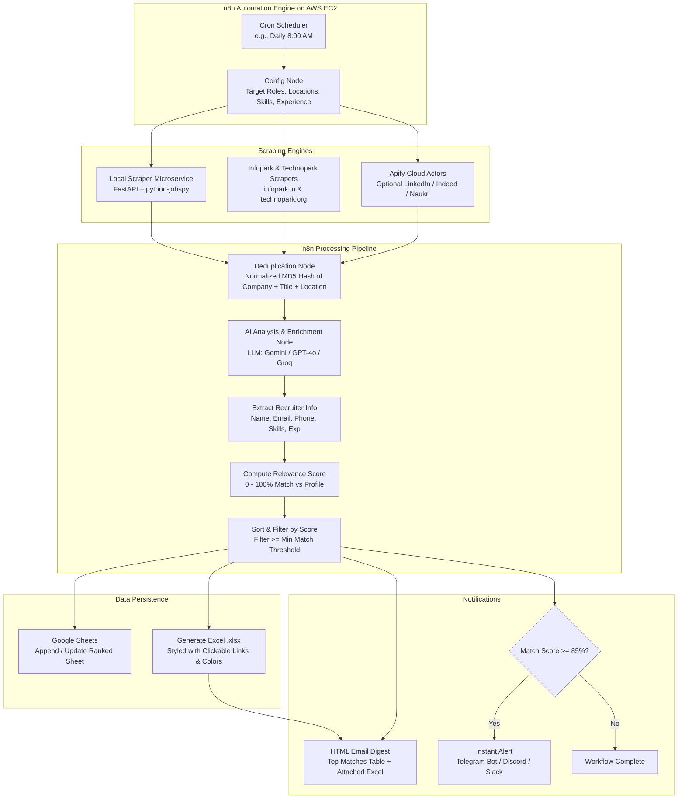

# Automated Job Search Workflow System Architecture & Implementation Plan

## Executive Summary
This project provides an automated, end-to-end job discovery and application tracking system. It periodically aggregates job postings from **LinkedIn, Indeed, Naukri, Kerala IT Parks (Infopark Kochi, Technopark Trivandrum), and direct company career portals**, analyzes and extracts recruiter details, evaluates job fit against the candidate's skills and experience using AI, ranks postings by relevance, populates a **Google Sheet / Excel file**, and delivers an **HTML email digest** with high-match alerts.

The system is orchestrated via **n8n** deployed on **AWS EC2** using Docker Compose with SSL and automated persistence.

---

## User Review Required

> [!IMPORTANT]
> **Scraping Architecture Choice**:
> We propose a dual-engine architecture:
> 1. **Zero-Cost / Self-Hosted Scraper Microservice** (FastAPI + `python-jobspy` + Custom Kerala IT Parks Parsers for Infopark & Technopark). Runs inside Docker on the same EC2 instance alongside n8n.
> 2. **Apify Cloud Actor Integration**: Configured directly in n8n for users who prefer managed cloud proxies for high-volume LinkedIn/Naukri runs.
> Both options can run in parallel or independently.
>
> **AI Provider for Scoring**:
> We provide plug-and-play support in the n8n workflow for:
> - **Google Gemini / OpenAI / Anthropic** (requires standard API key).
> - **Groq (Llama 3.3 70B)** (extremely fast and has a free tier).
>
> **Spreadsheet Destination**:
> Both Google Sheets (via Google Service Account / OAuth) AND native downloadable Excel (`.xlsx`) files generated and attached to emails are supported out of the box.

---

## System Architecture



---

## Data Schema (Target Columns)

The output Google Sheet and Excel file will contain the exact schema requested by the user, plus AI enrichment metrics:

| Column # | Field Name | Description | Example |
| :--- | :--- | :--- | :--- |
| 1 | **Match Score** | Calculated fit percentage (0 - 100%) | `92%` |
| 2 | **Job Title** | Designation / Role title | `Senior Full Stack Developer` |
| 3 | **Company Name** | Name of the hiring company | `UST Global` / `CareStack` |
| 4 | **Company Details** | Industry, size, or website link | `Enterprise Software, 10,000+ employees` |
| 5 | **Location** | City, State, or Remote/Hybrid indicator | `Kochi, Kerala (Hybrid)` |
| 6 | **Required Skills** | Clean comma-separated list of tech skills | `Python, React, PostgreSQL, Docker, AWS` |
| 7 | **Experience Requirements** | Years / level required | `3 - 5 Years` |
| 8 | **Salary** | Compensation range (if disclosed) | `₹12,00,000 - ₹18,00,000 PA` |
| 9 | **Job Posting Date** | When posted / discovered | `2026-09-05` |
| 10 | **Job URL** | Clickable link to job posting | `https://infopark.in/...` |
| 11 | **Application Method** | Easy Apply, Direct Portal, Email Resume | `Email Resume to HR` |
| 12 | **Recruiter Name** | Talent acquisition / recruiter name | `Anjali Menon` |
| 13 | **Recruiter Email Address** | Public HR/Recruiter contact email | `careers@company.com` |
| 14 | **Recruiter Phone Number** | Public phone / WhatsApp contact | `+91 98470 XXXXX` |
| 15 | **Source Website** | Origin portal | `Infopark`, `LinkedIn`, `Technopark`, `Naukri` |
| 16 | **Match Analysis / Summary** | Why it fits / Missing skills | `Strong match on React & Python; requires AWS` |
| 17 | **Status** | Tracking status for the user | `New` / `Applied` / `Interviewing` / `Ignored` |

---

## Proposed Changes & Project Structure

We will create a clean, modular repository with everything needed to run locally or deploy to AWS EC2:

```
JOB_SEARCH_AUTOMATION/
├── docker-compose.yml              # Complete EC2 stack (n8n, Postgres, Scraper Microservice, Caddy SSL)
├── .env.example                    # All configuration variables & credentials
├── README.md                       # Comprehensive guide and documentation
├── scraper-service/                # Python FastAPI Microservice
│   ├── Dockerfile
│   ├── requirements.txt            # python-jobspy, fastapi, uvicorn, beautifulsoup4, openpyxl, etc.
│   ├── app/
│   │   ├── __init__.py
│   │   ├── main.py                 # FastAPI API endpoints
│   │   ├── config.py               # Settings & defaults
│   │   ├── scrapers/
│   │   │   ├── __init__.py
│   │   │   ├── jobspy_scraper.py   # LinkedIn, Indeed, Naukri, Glassdoor
│   │   │   ├── infopark_scraper.py # Infopark Kochi (infopark.in) scraper
│   │   │   ├── technopark_scraper.py # Technopark Trivandrum (technopark.org) scraper
│   │   │   └── google_jobs_scraper.py # Direct company career site queries
│   │   └── utils/
│   │       ├── excel_generator.py  # Styled .xlsx creator with formulas & hyperlinks
│   │       └── deduplicator.py     # Hash-based job deduplication
├── workflows/                      # Ready-to-import n8n Workflow JSON files
│   ├── master_job_search_workflow.json # Master n8n workflow (Scrape -> Dedup -> AI Score -> Sheets -> Email)
│   ├── apify_job_search_workflow.json  # Dedicated Apify Actor workflow template
│   └── components/
│       ├── ai_scoring_prompt.md    # Production prompt for LLM evaluation
│       └── email_template.html     # Responsive HTML email digest template
├── templates/
│   └── google_sheets_schema.csv    # Headers and structure for Google Sheets
└── scripts/
    ├── setup-ec2.sh                # Automated EC2 setup script (Docker, Firewall, Swap, Caddy)
    ├── test_scrapers.py            # Diagnostic script to test scraping locally
    └── backup_n8n.sh               # Routine backup script for workflows and state
```

---

## Detailed Component Plans

### 1. Scraper Microservice (`scraper-service/`)
- Built with **FastAPI** + **`python-jobspy`** + **`BeautifulSoup4`** + **`httpx`**.
- Endpoints:
  - `POST /scrape`: Accepts search parameters (keywords, location, experience level, sources list). Runs parallel scrapers across requested sources:
    - **LinkedIn & Indeed & Naukri**: Handled via `python-jobspy` with country targeting (`India` or international).
    - **Infopark Kochi**: Queries `infopark.in/companies-job`, parses listings, extracts company names, emails, phone numbers, and apply links.
    - **Technopark Trivandrum**: Scrapes `technopark.org/job-search`, parses Inertia data / DOM for active company vacancies and contact details.
  - `POST /generate-excel`: Takes JSON job list and returns a styled binary `.xlsx` with column widths, colored score pills, and clickable URLs.
  - `GET /health`: Health check for container monitoring.

### 2. n8n Master Workflow (`workflows/master_job_search_workflow.json`)
- **Node 1: Schedule Trigger** - Configured for 08:00 AM daily or manual testing trigger.
- **Node 2: User Settings / Profile (Set Node)**:
  - Target Job Titles: `["Full Stack Developer", "Python Developer", "Backend Engineer"]`
  - Target Locations: `["Kochi", "Trivandrum", "Bangalore", "Remote", "India"]`
  - Candidate Skills: `["Python", "FastAPI", "React", "Node.js", "PostgreSQL", "Docker", "AWS"]`
  - Candidate Experience: `3 Years`
  - Minimum Match Score for Alert: `75`
- **Node 3: Scraper API Call (HTTP Request)** - Calls the scraper service or Apify.
- **Node 4: Deduplication Engine (Code Node)**:
  - Generates unique hash for each job (`hash(title + company + location)`).
  - Maintains run history / checks against Google Sheets existing IDs to skip duplicate postings.
- **Node 5: AI Enrichment & Matcher (n8n AI Agent / HTTP Request)**:
  - Sends job title, description, company to LLM (OpenAI / Gemini / Groq).
  - LLM extracts recruiter contact info (regex + context), required vs optional skills, experience requirement, and assigns a match score (0-100) with reasoning.
- **Node 6: Sort & Filter (Code Node)**:
  - Sorts new jobs by match score descending.
- **Node 7: Google Sheets Node**:
  - Appends new jobs to Google Sheets with full formatting.
- **Node 8: Excel Generation Node**:
  - Creates the downloadable `.xlsx` workbook.
- **Node 9: Email Notification (Send Email / Gmail / SMTP Node)**:
  - Sends rich HTML digest with top matched job summary cards, direct recruiter links, and the `.xlsx` file attached.
- **Node 10: Instant Alert (Telegram / Discord / Slack)** (Optional):
  - Sends an instant message if any job scores >= 85%.

### 3. AWS EC2 Deployment Architecture
- **Instance Type Recommendation**:
  - `t3.small` (2 vCPU, 2GB RAM) or `t4g.small` (AWS Graviton) is recommended.
  - Alternatively, AWS Free Tier `t2.micro` (1GB RAM) with an automated 2GB swap file created by our `setup-ec2.sh` script.
- **Container Stack**:
  - `n8n`: Official n8n Docker image with webhook tunneling, community nodes support.
  - `postgres`: Dedicated database for n8n execution history and credential security.
  - `job-scraper-service`: Python FastAPI container running locally on port 8000 (accessible only internally inside the Docker network).
  - `caddy`: Automatic HTTPS reverse proxy that fetches and renews Let's Encrypt certificates automatically for your custom domain or AWS public DNS.
- **Single-Command Setup Script (`setup-ec2.sh`)**:
  - Installs Docker, Docker Compose, Git.
  - Configures a 2GB swap partition for stability.
  - Sets up UFW firewall (allows 22, 80, 443).
  - Launches containers with `docker compose up -d`.

---

## Verification Plan

### Automated / Local Testing
1. Test scraper microservice endpoints with test search terms (`Python Developer`, `Kochi`).
2. Verify Infopark & Technopark scraping logic against live web responses.
3. Validate Excel generation with sample job data, ensuring hyperlinks, styling, and score formatting are intact.
4. Validate n8n workflow JSON structure and node schema compatibility.

### User Verification Steps
1. **Local or EC2 Deployment**: Follow the step-by-step instructions in `README.md` to run `docker compose up -d`.
2. **Access n8n**: Open `http://<ec2-ip>:5678` or `https://<your-domain>`.
3. **Import Workflow**: Import `workflows/master_job_search_workflow.json`.
4. **Configure Credentials**: Fill in your candidate profile in the Config Node, add your Google Sheets / SMTP / AI API keys.
5. **Run Test Execution**: Click "Test step" or "Execute workflow" and verify:
   - Jobs are collected from multiple platforms.
   - Match scores and recruiter details are extracted.
   - Google Sheet updates and an email with the Excel attachment arrives in your inbox.
